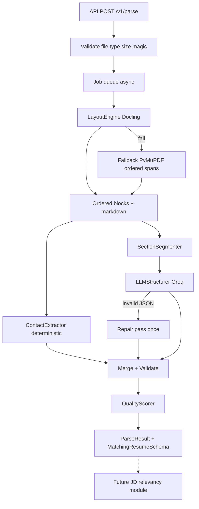

# Production ATS Parser (Pure Python)

## Architect verdict

Build a production resume parser whose **primary business output** is the fixed JSON schema required by the future **JD relevancy module**. Layout (Docling), quality gates, and API envelope wrap that schema — they do not replace it.

**JD matching is out of scope for this build.** This parser only guarantees a stable, validated payload that matching can score later.



---

## Canonical matching schema (locked)

This is the **contract** the parser must produce for every successful/partial parse. Field names and shapes are fixed so the JD module can depend on them without adapters.

```json
{
  "raw_resume_text": "",
  "professional_summary": "",
  "skills": [],
  "experience": [
    {
      "company": "",
      "designation": "",
      "start_date": "",
      "end_date": "",
      "description": ""
    }
  ],
  "projects": [],
  "education": [
    {
      "degree": "",
      "institution": "",
      "cgpa": "",
      "graduation_date": ""
    }
  ],
  "certifications": []
}
```

### Field rules (parser obligations)

| Field | Type | Rules |
|---|---|---|
| `raw_resume_text` | `str` | Full reading-order text from layout (Docling markdown flattened to text, or equivalent). Always populated if layout succeeded. This is what matching uses for broad lexical/semantic overlap. |
| `professional_summary` | `str` | Single contiguous summary string. Explicit Summary/Profile section, else pre-heading body. **Never** bold-shredded fragments. |
| `skills` | `list[str]` | **Flat** list of skill strings (not categorized objects). If layout finds a skills table, flatten all cells/categories into unique items. |
| `experience` | `list[object]` | One object per job. `description` is a **single string** (bullets joined with newlines). Empty string for unknown fields — never omit keys. |
| `projects` | `list[str]` | Flat list of project strings (title + key detail in one string, or title only if that is all that exists). |
| `education` | `list[object]` | Keys exactly: `degree`, `institution`, `cgpa`, `graduation_date`. Empty strings if unknown. |
| `certifications` | `list[str]` | Flat list of certification name strings. |

Pydantic model name: `MatchingResumeSchema` in [`parser/models.py`](parser/models.py). LLM prompts and golden tests target **this schema only**.

### What stays outside the matching schema

Contact/identity are useful for ATS UI and quality scoring but are **not** in the JD contract. Put them on the envelope:

```python
class CandidateExtras:
    name: str = ""
    emails: list[str] = []
    phones: list[str] = []      # E.164 preferred; also keep raw in provenance if needed
    links: list[str] = []

class ParseResult:
    schema_version: str                    # matching schema version, e.g. "matching.v1"
    status: Literal["ok", "partial", "failed"]
    resume: MatchingResumeSchema | None    # JD module input
    candidate: CandidateExtras             # UI / ops only
    confidence: float
    field_confidence: dict[str, float]
    warnings: list[str]
    needs_review: bool
    provenance: Provenance
    job_id: str
```

API responses return `ParseResult`. The JD module (later) consumes **only** `result.resume` (`MatchingResumeSchema`). No breaking changes to that object without bumping `schema_version`.

---

## Gaps found earlier (still apply)

| Gap | Fix |
|---|---|
| No API / job model | FastAPI + async jobs |
| No Docling fallback | Band-aware PyMuPDF → explicit fail |
| No confidence | QualityScorer + `needs_review` |
| LLM SPOF | Deterministic contact/sections; LLM fills matching fields |
| No versioning | `schema_version: matching.v1` |
| Input security | Size/page/magic limits + timeouts |
| Ops / memory | Model prewarm, singleton converter, worker recycle |
| Weak eval | Golden set against `MatchingResumeSchema` |
| Bold shredding | Removed from live path |
| PII / injection | No full resume at INFO; prompt hierarchy |

---

## Module architecture

```
parser/
  config.py
  models.py              # MatchingResumeSchema + ParseResult + CandidateExtras
  errors.py
  layout/
    docling_engine.py
    pymupdf_fallback.py
    service.py
  sections.py
  contact.py             # fills CandidateExtras only
  structure/
    prompts.py           # prompts emit MatchingResumeSchema JSON
    groq_client.py
    structurer.py
  quality.py
  pipeline.py            # always assembles MatchingResumeSchema
  legacy/
api/
  main.py
  routes_parse.py
  jobs.py
tests/
  fixtures/cvs/
  golden/                # MatchingResumeSchema JSON per fixture
  ...
```

Future (not this build): `matching/` module that takes `(job_description_text, MatchingResumeSchema) → relevancy score`.

---

## Stage design (aligned to matching schema)

### 1. Ingest & guardrails

- Accept `.pdf`, `.docx`; `.doc` only if LibreOffice configured.
- Reject oversize / over-page / bad magic; job timeout default 120s.

### 2. LayoutEngine

- Docling primary → ordered markdown + blocks.
- Fallback: band-aware PyMuPDF.
- `raw_resume_text` = layout reading-order text (required for matching).

### 3. SectionSegmenter

- Map headings → summary / skills / experience / education / projects / certifications.
- Pre-heading body → `professional_summary` when no summary heading.
- Never split on bold alone.
- Skills tables → flatten to `list[str]` (categories discarded for matching contract).

### 4. ContactExtractor → `CandidateExtras` only

- Does not alter `MatchingResumeSchema`.

### 5. LLMStructurer → fill matching fields

- Emit JSON conforming to `MatchingResumeSchema` (minus `raw_resume_text`, which comes from layout).
- `experience[].description`: one string, preserve bullets via `\n`.
- `skills` / `projects` / `certifications`: flat string arrays.
- Retry once + repair once; on failure leave empty arrays/strings and set partial + warning.
- No paraphrase; empty string if unknown.

### 6. QualityScorer

- Validate `MatchingResumeSchema` keys/types always present.
- Lower confidence if `raw_resume_text` empty, `experience` empty when text suggests jobs, missing dates, layout fallback, OCR.
- `needs_review` below threshold.

---

## API

- `POST /v1/parse` → job; `GET /v1/parse/{id}` → `ParseResult` with `resume: MatchingResumeSchema`.
- Health / ready / metrics as before.
- Optional later: `POST /v1/match` (JD + resume id) — **not in this build**.

---

## Evaluation

Golden files must match `MatchingResumeSchema` exactly (field names above).

CI field F1 on: `skills` items, `experience.company`, `experience.designation`, `experience.start_date`, `education.institution`, `education.degree`, `professional_summary` non-empty continuity, `raw_resume_text` contains key phrases in order.

Fixture classes unchanged (single-col, sidebar, mixed 1→3→1→2, skills grid, OCR, multi-page, international contact on `candidate` only).

---

## Implementation phases

**A** — Foundation: `MatchingResumeSchema` + `ParseResult`, config, deps, archive legacy.  
**B** — Layout + sections; populate `raw_resume_text` + section slices.  
**C** — Structurer → matching fields; quality; `parse_resume`.  
**D** — API/jobs/Docker/metrics.  
**E** — Golden eval gates on matching schema.

---

## Success criteria

- Every `ok`/`partial` response includes a complete `MatchingResumeSchema` object (all keys present).
- Mixed-band CV: correct reading order in `raw_resume_text` and coherent `experience[].description`.
- `professional_summary` is one string; `skills`/`projects`/`certifications` are flat string arrays.
- JD module can call `result.resume` with zero field renaming.
- Contact lives only under `candidate`; matching schema stays stable as `matching.v1`.
- Production envelope, fallbacks, and ops requirements from the prior plan still hold.
